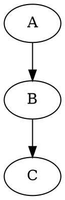

对于熟悉markdown的人来说，用gitbook写电子书是很自然的选择。当然，sphinx也非常不错。

<!-- more -->

# 需求和工具选择

制作电子书的需求，来自要为自己开发的策略平台编写用户文档，几个要求如下：

- 使用轻量级标记语言
- 能够预览
- 能够生成html和pdf
- 能够嵌入公式
- 能够嵌入graphviz, plantuml等图形描述语言

我找到了[GitBook](https://www.gitbook.com/) 和 [Sphinx Doc](http://www.sphinx-doc.org/en/stable/)。主要的区别在于：

- 设计目的
  GitBook的目的就是制作电子书，而Sphinx Doc的目的是为python项目编写文档
- 开发语言
  GitBook使用javascript开发，Sphinx Doc使用python开发
- 标记语言
  GitBook支持markdown, Sphinx Doc最开始只支持rst, 现在同时也支持markdown

应该说，两个工具都很棒。二者都可以通过进行插件扩展，所以在功能上没有本质上的区别：一方能有的功能，另一方也可以有。

这里，先整理一下 GitBook 的使用。

# 快速开始

## 安装

```{bash}
npm install gitbook-cli
```

## 初始化

```
mkdir mybook
cd mybook
gitbook init
```

## 预览

```
gitbook serve
```
可以用浏览器访问 <http://localhost:4000>

## 生成

```
# 生成html,到 `_book/` 文件夹
gitbook build

# 生成pdf, 需要先安装 gitbook-pdf
npm install gitbook-pdf -g
gitbook pdf

```

## 发布

可以发布到[GitBook](https://www.gitbook.com/), 当然也可以把 html 发布到 github。

## 编辑器

最好使用 vim 等文本编辑器，如果不习惯，GitBook 也提供了专门的[编辑器](https://www.gitbook.com/editor)。但这个编辑器对[GitBook网站](https://www.gitbook.com/)的绑定太过，不用也罢。

# 扩展

## 配置

每本电子书都可以通过 `book.json`文件进行配置，比如：

```
{
  "gitbook": "2.x.x",
  "title": "Demo演示",
  "description": "验证GitBook的功能",
  "language": "zh",
  "structure": {
    "readme": "README.md"
  },
  "pluginsConfig": {
    "fontSettings": {
      "theme": "white",
      "family": "msyh",
      "size": 2
    },
    "plugins": [
      "yahei",
      "katex",
      "-search"
    ]
  },
  "pdf": {
    "toc": true,
    "pageNumbers": true,
    "fontSize": 12,
    "paperSize": "a4",
    "margin": {
      "right": 30,
      "left": 30,
      "top": 30,
      "bottom": 50
    }
  }
}

```

## Math

GitBook v2.1.0 开始，内置了[Mathjax插件](https://plugins.gitbook.com/plugin/mathjax)支持 数学公式。

需要在 `book.json`中配置：

```
{
    "plugins": ["mathjax"]
}
```
然后执行
```
gitbook install
```

可以用 `{ % math %}...{ % endmath %}` 或 `$$...$$` 标记公式：

```
When { % math %}a \ne 0{ % endmath %}, there are two solutions to { % math %}(ax^2 + bx + c = 0){ % endmath %} and they are { % math %}x = {-b \pm \sqrt{b^2-4ac} \over 2a}.{ % endmath %}

When$$a \ne 0$$, there are two solutions to$$(ax^2 + bx + c = 0)$$and they are$$x = {-b \pm \sqrt{b^2-4ac} \over 2a}.$$
```


## graphviz

使用插件[gitbook-plugin-graphviz](https://github.com/darvasd/gitbook-plugin-graphviz)

```
"plugins": [
    "graphviz@git+https://github.com/darvasd/gitbook-plugin-graphviz.git"
]
```

```
gitbook install
```




## plantuml

- gitbook-plugin-uml
可以使用前面提到的[gitbook-plugin-uml](https://github.com/vowstar/gitbook-plugin-uml)

```
npm install gitbook-plugin-uml
```

在 `book.json`中配置插件：

```
{
  "plugins": ["uml"]
}
```

例子：

```uml
@startuml

    Class Stage
    Class Timeout {
        +constructor:function(cfg)
        +timeout:function(ctx)
        +overdue:function(ctx)
        +stage: Stage
    }
    Stage <|-- Timeout

@enduml
```

也可以使用引用的方式：

```

```

另外一个插件是[gitbook-plugin-plantuml](https://plugins.gitbook.com/plugin/plantuml), 大体类似。

## 模板
(TODO)


